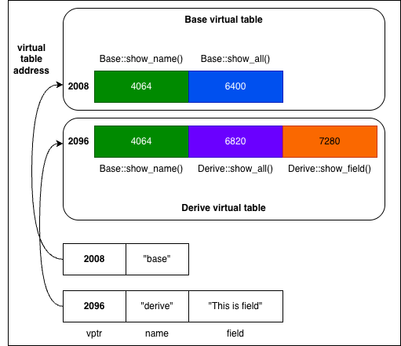

# Polymorphism

The same interface shows different behaviors on different objects.

## Compile time polymorphism (Static Polymorphism)

Depends on the type of object declaration.
```cpp
class Animal {
public:
    void speak() { std::cout << "Animal sound\n"; }
};

class Dog : public Animal {
public:
    void speak() { std::cout << "Woof\n"; }
};

Animal* obj = new Dog();
obj.speak(); // Animal sound
```

Another type of compiler polymorphism is [template](./templates.md).

## Runtime polymorphism (Dynamic Polymorphism)

Depends on the type the object points to.

```cpp
class Animal {
public:
    virtual void speak() { std::cout << "Animal sound\n"; }
};

class Dog : public Animal {
public:
    void speak() override { std::cout << "Woof\n"; }
};

Animal* obj = new Dog();
obj->speak(); // Woof
```

## Compare
| Static | Dynamic |
| :---: | :---: |
| ✅ compiler | ❌ compiler |
| Overload | Override |
| different parameters / signature / return type | same parameters / signature, but associated in a class / subclass |
| function overloading, templates, CRTP | virtual function ➕ pointers |
| fast execution, zero-cost abstraction | slow execution |
| ✅ inline<sup>[1]</sup> | ❌ cannot inline |
| ✅ optimization<sup>[2]</sup> | ❌ no optimization |
| ❌ code bloat<sup>[3]</sup> | ✅ code won't bloat |
| less flexible<sup>[4]</sup> | more flexible |
| High-performance library, generic programming, numerical calculation | Requires [ABI](./abi.md) stability |

> [1] Inline means that the compiler replaces the function call with the function body itself instead of making a real function call.

> [2] static supports some optimizations because the compiler can know what the code is; while dynamic needs to be checked at runtime
> * Constant Propagation: If a variable is a constant value, the compiler directly replaces
> ```cpp
> int x = 2;
> int y = x + 3; // replace with `int y = 2 + 3;`
> ```
> * Dead Code Elimination: The compiler deletes code that will never be executed
> * Loop Optimization
> * Loop Unrolling (loop unrolling)
> * Loop Invariant Code Motion (fixed calculation in moving loop)
> * Strength Reduction (expensive calculation replacement)
> ```cpp
> // loop unrolling
> for (int i = 0; i < 2; ++i) {arr[i] = 0;} // -> arr[0] = 0, arr[1] = 0;
> 
> // loop invariant code motion
> for (int i = 0; i < n; ++i) {int x = a + b; arr[i] = x * i;} // move `int x = a + b;` outside loop
>
> // strength reduction
> for (int i = 0; i < n; ++i) {x = i * 8;} // multiply -> add, change it to `x += 8;`
> ```

> [3] Code Bloat → Code bloat, for example, the template function generates a function for each type, causing the binary to become larger

> [4] For static polymorphism, there are some problems such as: the types are difficult to unify (`Base<A>` and `Base<B>` are two types), and the interface is also very complex `static_cast<Derived*>(base_ptr)`. But not for dynamic polymorphism: you can use base ptr to represent class and subclass (`vector<Base*> derived`).

---

# virtual

Virtual functions are implemented through vtable virtual function tables. Each object contains a vptr virtual pointer pointing to the vtable.

> [!NOTE]
> * vtable is class-level, that is, each class has only one vtable
> * vptr is instance-level, that is, each instance has a vptr pointing to the vtable
>
> vtable is placed in the .rodata read-only program section, not the stack area!

```cpp
class Base {
    char name[40];
public:
    virtual void show_name();
    virtual void show_all();
};

class Derive : public Base {
    char name[40];
    char field[40];
public:
    void show_all();
    virtual void show_field();
};

Base base("base");
Derive derive("derive", "This is field");
```


If you use the following method call, it is equivalent to the following process
```cpp
Base* ptr = &derive;
ptr->show_all();
```
```
ptr --> (2096) --> show_all --> (6820) --> 函数定义
```

## Object Slicing

Virtual must be implemented with pointer/reference and cannot be by value because it will directly Object Slicing. It can be directly considered that when pressing by value, only the "declared type" part is retained, and the remaining "derived type" part is sliced.
```cpp
class Base {
public:
    virtual void func() {}
};

class Derived : public Base {
public:
    void func() override {}
};

Derived d;
Base b = d;
b.func();   // 此时调用的是Base的function
```

---

# purevirtual

Used to define interfaces and cannot be instantiated. This class is called Abstract Class (ABC).

```cpp
class Interface {
    virtual void speak() =0;

    int function() { return 1024; }
    virtual void walk() { std::cout << "walk in interface\n"; }
}

class Impl : public Interface {
    void speak() override { std::cout << "speak\n"; }
    void walk() { std::cout << "walk in impl\n"; }
}

Interface interface; // ❌
Impl impl; // ✅
```

---

# CRTP

CRTP (Curiously Recurring Template Pattern) is a compile-time polymorphic technology, which is characterized by **The subclass treats itself as the template parameter of the parent class** `class Child : Parent<Child>`.

```cpp
template<typename Derived>
class Base {
public:
    void interface() {
        static_cast<Derived*>(this)->implementation();
    }
};

class Derived : public Base<Derived> {
public:
    void implementation() {
        std::cout << "Derived implementation\n";
    }
};
```

The core role of CRTP
* Replace some virtual functions with compile-time polymorphism (zero virtual call overhead, can be inline)
* Reuse logic in the base class and call the derived class implementation at the same time
* Make static interface constraints (with concepts / SFINAE)
* Better performance (no vtable)

CRTP is suitable for places where "polymorphic behavior is required, but performance and compile-time constraints are more important".

---

# `std::variant` vs polymorphism

Please refer to [`std::variant` and `std::visit`](./std-variant-and-visit.md).
