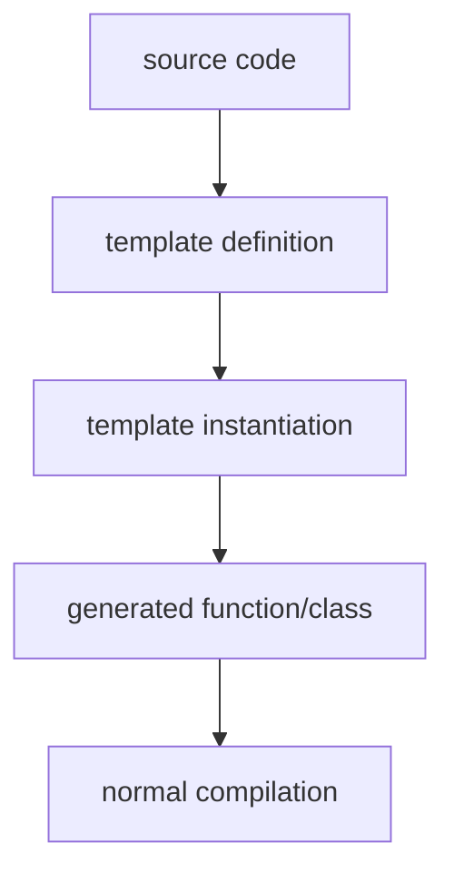

# What is Template

`template` is a generic programming mechanism for C++ that allows writing type-independent code. In this way, programmers do not have to repeatedly write functions with the same logic but processing different types of data.

`template` is not a runtime mechanism, it is a compile-time code generation system


---

# Template process

```
template call
     │
     ▼
template argument deduction
     │
     ▼
substitution
     │
     ├── failure → SFINAE → remove candidate
     │
     ▼
overload resolution
     │
     ▼
template chosen
     │
     ▼
template instantiation
     │
     ├── error → compile error
     │
     ▼
generated code
```

---

# Compile time instantiation

The compiler generates an instance (**instantiation**) of a specific function or class based on the actual type used.

```cpp
template<typename T>
T add(T a, T b) {
    return a + b;
}
```
When the code is used:
```cpp
add<int>(1,2);
add<double>(1.0,2.0);
```
The compiler will generate:
```cpp
int add(int a, int b);
double add(double a, double b);
```

> [!NOTE]
> The implementation of `template` must be placed in the header file. Assuming that the template function is defined in header and implemented in cpp, then the compilation fails `undefined reference`.
>
> Ordinary functions only need to be declared, and the linker will later find the corresponding **"unique"** implementation from the .o file.
>
> And `template` just defines a **"How to generate code"** instruction manual, and the code will only be generated when a specific call is encountered.
> ```cpp
> // add.h
> template<typename T>
> T add(T a,T b){
>     return a+b;
> }
> ```
> ```cpp
> // main.cpp
> #include "add.h"
> 
> int main() {
>     add<int>(1, 2);
>     add<double>(1.0, 2.0);
> }
> ```
>
> If template is written in .cpp, then the compiler cannot see the template definition in main.cpp, so it cannot be instantiated. Because when the compiler sees `add<int>(1, 2);`, it knows that it needs to generate a function `int add(int,int);` that supports int type according to the manual. When it sees `add<double>(1.0, 2.0);`, it knows that it needs to generate `double add(double, double);` that supports double. However, **template can support any type, and the function logic of different types may be different**, so you need to know the general function logic or what the logic should be for a certain type when reading the declaration (that is, accessing the .h file).

> [!NOTE]
> For ordinary functions, if the function is defined in the header, it will violate the ODR.
>```cpp
> // util.h
> int function(int a, int b) {...};
>
> // a.cpp
> #include "util.h"
>
> // b.cpp
> #include "util.h"
> ```
> Then when linking, two identical ones, `a.o --> int function(int, int)` and `b.o --> int function(int, int)`, will appear.
>
> But for template functions, since they must be defined in the header, the compiler has special processing.
> ```cpp
> // util.h
> template<typename T>
> T function(T a, T b) {...}
>
> // a.cpp
> #include "util.h"
> function(1, 2);
> 
> // b.cpp
> #include "util.h"
> function(1, 2);
> ```
> Both of them generate `a.o --> int function<int>(int, int);` and `b.o --> int function<int>(int, int);`, but the C++ standard allows multiple identical instances of template, and Linker will merge them (COMDAT folding / weak symbol), which is called **ODR-use compatible**.

---

# Specialization

For example, if a template has specific logic for certain special types, we call it "specialization" of these function definitions.

| | Full specialization | Partial specialization |
| :---: | :---: | :---: |
| **Function Template** | ✅ | ❌ |
| **Class Template** | ✅ | ✅ |

> For functions, there is no need for partial specialization because of function overloading (overload), the compiler will automatically select a more matching function.


* Full specialization → all parameters are fixed
```cpp
template<typename T>
T func(T t) {...}

template<>
int func(int t) {...}
```

* Partial specialization → Fixed some parameters
```cpp
template <typename T, typename U>
class MyClass {...}

template <typename T>
class MyClass<T, int> {...}

// ⚠️ 不能调用 `MyClass<int, int>` 因为有两个定义都匹配
// 报错 `ambiguous partial specialization`
template <typename T>
class MyClass<T, T> {...}
```
```cpp
template <typename T>
class MyClass {...}

// 这个也是偏特化，针对指针
template <typename T>
class MyClass<T*> {...}
```

> ⚠️ Type pointers and references are also considered a type! That is, `int` and `int*` are two types!

For the template function, the following content is correct, except that they are not partial specialization but function overloading, so the `MyClass<int, int> --> ambiguous partial specialization` error will not occur, and the compiler will automatically match the "more specific" function.
```cpp
template <typename T>
void func(T t) {...}

template <typename T, typename U>
void func2(T t, U u) {...}

// 这个是函数重载不是偏特化
// ⚠️ `void func<T*>(T* t)` 是错误的，因为我们现在是重载不是偏特化
template <typename T>
void func(T* t) {...}

// 这个是函数重载不是偏特化
// ⚠️ `void func2<T, int>(T t, int u)` 是错误的，因为我们现在是重载不是偏特化
template <typename T>
void func2(T t, int u) {...}
```
---

# Variadic template

## Template function
```cpp
template<typename... Args>
void print(Args... args) {
    std::cout << sizeof...(args) << sizeof...(Args) << args;
}

print(1, 3.14, 'a'); // Args... = int, double, char; args... = 1, 3.14, 'a'
```

## Template variables
```cpp
template<typename... Args>
constexpr size_t count = sizeof...(Args);

count<>;                 // 0
count<int>;              // 1
count<int, int, double>; // 3
```

## Parameter Pack Expansion
Parameter package expansion is to "spread" each element, such as
```cpp
template<typename... Ts>
void f(Ts... args) {
    g(args...);
}

f(1, 2.5, "abc"); // g(1, 2.5, "abc")
```

## Fold Expression
A fold expression is to expand and connect them with an operator.

### One dollar left fold `(... op args)`

```cpp
template<typename... Ts>
auto minus(Ts... args) {
    return (... - args);
}

minus(1, 2, 3, 4); // ((1 - 2) - 3) - 4;
```

### One dollar right fold `(args op ...)`

```cpp
template<typename... Ts>
auto minus(Ts... args) {
    return (args - ...);
}

minus(1, 2, 3, 4); // 1 - (2 - (3 - 4));
```

### Binary left fold `(start op ... op args)`

Can handle empty parameter packs.

```cpp
template<typename... Ts>
auto minus(Ts... args) {
    return (100 - ... - args);
}

minus(1, 2, 3, 4); // (((100 - 1) - 2) - 3) - 4;
minus()； // 100
```

### Binary right fold `(args op ... op end)`

Can handle empty parameter packs.

```cpp
template<typename... Ts>
auto minus(Ts... args) {
    return (args - ... - 100);
}

minus(1, 2, 3, 4); // 1 - (2 - (3 - (4 - 100)));
minus(); // 100 ⚠️ 不是-100，因为没有参数包就退化成只有初始值
```

---
# NTTP (Non-Type Template Parameter)

That is, what is passed into the template is not a type, but a compile-time constant.

```cpp
template<int size>
struct Array {
     int data[size];
}

Array<10> arr;
```
Of course, you can also use `auto` instead.

```cpp
template<auto V>
struct Const { static constexpr auto value = V; };

Const<42> x;
Const<'A'> y;

```

Other structured types can also be used.
```cpp
struct Config {
    int level;
    bool fast;
    constexpr bool operator==(const Config&) const = default;
};

template<Config C>
struct Engine {};
```

> ⚠️ Don’t abuse it. Code expansion may be very obvious. For example, when using `template<int N>`, different N passed in will generate different codes during compilation. For example, `Array<1>` and `Array<2>` have two codes.

---

# Advanced features

* [SFINAE](./sfinae.md)
* [concept](./concepts-and-requires.md)
* [CRTP](./polymorphism.md#CRTP)
* [Compile-time Computation](./constexpr.md)
* [type traits](./type-traits.md)
* [allocator model](./allocator.md)
