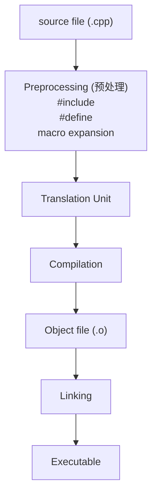

# What is Traslate Unit

Translation Unit is the most basic unit of C++ compilation. The complete code of a `.cpp` file after preprocessing is a Translation Unit.

> [!NOTE]
> Translation Unit = .cpp + the complete code after all include expansions



Each Translation Unit:
* Independent compilation
* Don't know about other TU implementations
* Only the statement can be seen
* TU linked via linker

---

# ODR (One Definition Rule)

An entity can only have one definition in the entire program. This is why for ordinary functions, the definition cannot be written in the header file. When multiple cpp files include this header, there will be multiple TUs containing the same function definition.

But for template, we need to implement the function definition in the header because essentially the template is not a definition, but a "manual" that helps generate definitions. For details, refer to [template](./templates.md).

| Type | Allowed | Reason |
| :---: | :---: | :---: |
| Ordinary functions | ❌ | ODR violation |
| inline function | ✅ | Allow multiple definitions |
| template function | ✅ | Compile time instantiation |
| static function | ✅ | internal linkage |
| constexpr function | ✅ | Default inline |

---

# internal vs external linkage

Linkage refers to: whether a name variable/function/object points to the same entity between multiple TUs. To put it simply, the name seen in different .cpp files is the same thing.

```
// external linkage
file1.cpp ----\
                > global_var
file2.cpp ----/

// internal linkage
file1.cpp ----> var
file2.cpp ----> var
```

##### external linkage
This name is unique throughout the program and can be shared by multiple TUs.
```cpp
// utils.h
extern int global_var;
void func();
```
```cpp
// utils.cpp
int global_var = 10;
void func() {}
```
```cpp
// main.cpp
#include "utils.h"

void main() {
    global_var = 20;
    func();
}
```

##### internal linkage
This name is only visible in the current TU, and there will be no conflict even if the same name appears in multiple TUs.

```cpp
// file1.h
static int x = 10;
```
```cpp
// file2.h
static int x = 10;
```

Generally, this can be achieved using `static` and `anonymous namespace`.

---

# inline
If the function or global variable we define in the header is inline, the ODR problem will not be triggered. Because inline function allows multiple identical definitions.

```cpp
// utils.h
void simple_func() {...}        // ❌ violates ODR
inline void inline_func() {...} // ✅
```

---

# constexpr

Details: [constexpr](./constexpr.md).
