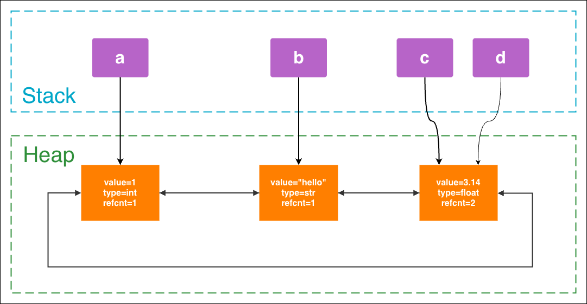

# Reference counting

The core memory management method of CPython is **reference counting**: each object will record how many references currently point to it. When the reference count becomes 0, the object can usually be released immediately.

```python
a = []  # count of list is 1
b = a   # count of list is 2

del a
del b   # count of list is 0, may be collected
```

> [!NOTE]
> `del` does not delete the object, but deletes the reference of the object (the binding relationship between the variable name and the object). As long as the reference counting of the object is not 0, the object still exists.

---

# Underlying model

Any type in Python is a class and a variable reference.

So in fact, space is allocated on the heap to store content, and then variables are saved on the stack to reference the space.

On the heap, what is actually stored is something similar to a **doubly linked list**:
```c
typedef struct _object {
    struct _object *_ob_next;   // 后向指针
    struct _object *_ob_prev;   // 前向指针
    Py_ssize_t ob_refcnt;       // ref count
    PyTypeObject *ob_type;
} PyObject;
```

For example, the following code will produce the following stack allocation:
```py
a = 1
b = "hello"
c = 3.14
d = c
```


---

# GarbageCollector

There is a classic problem with reference counting: **Circular Reference**:

```python
a = []
b = []
a.append(b)
b.append(a)

del a
del b   # 底层对象仍然是互相引用，计数器不为0，但是又没法访问
```

Python's GC will periodically scan the object graph to find objects that "although they refer to each other, are no longer reachable as a whole", and then recycle them.

---

# Weak reference `weakref`

Weak references do not increase the object's reference count "ownership relationship" and can be used for:
- cache
- Observe objects without preventing their recycling
- Avoid strong reference cycles in certain scenarios

Somewhat similar to `std::weak_prt<>` in C++.

---

# memory leak

Although Python has a GC, the "memory growing" problem may still occur.

## What does "memory leak" in Python mean?

In C++, memory leaks usually refer to:

> A piece of memory is no longer used, but the program has no way to release it.

In Python, it is often said that "memory leak" is more accurately:

> The object is no longer needed, but it can still be accessed by the program (the reference is always held in the reference chain), causing it to be unable to be recycled and the memory usage continues to grow.

Therefore, "memory leaks" in Python are often divided into two categories:

- **Logical leak**: The object should have been released, but it has been referenced by containers, caches, closures, global variables, etc.
- **Real Leak**: Underlying C extensions, interpreter bugs, and third-party library bugs cause real memory loss, and the Python layer cannot control it.

## Common reasons

### The container continues to hold references

The most common situation is:

- `list` constantly `append`
- `dict` continuously fills in new data
- `set` keeps getting bigger
- A certain long-life cycle object always retains historical data

```py
cache = []

def process(data):
    result = do_something(data)
    cache.append(result)  # 永远不清理
```

This is not a GC failure, but `cache` has always been alive, so of course the objects in it have also been alive.

### Global cache is not cleared

For example:

```py
user_cache = {}

def get_user(user_id):
    if user_id not in user_cache:
        user_cache[user_id] = load_user(user_id)
    return user_cache[user_id]
```

If the number of keys continues to increase and there is no expiration policy, this cache will grow indefinitely.

So the cache itself does not equal a leak, but:

- No upper limit
- No elimination strategy
- The life cycle is as long as the process

It can easily behave like a memory leak.

### Closure/callback accidentally holds large object

```py
def make_handler(big_data):
    def handler():
        return len(big_data)
    return handler
```

As long as `handler` is alive, `big_data` will always be referenced by the closure.

This kind of problem is relatively hidden, because you may think that you only left a "small function", but in fact, you also left a large object.

### Circular reference

Circular references themselves are not necessarily problematic, as Python's GC handles many of these situations.

But it still deserves vigilance, especially when the object relationship is complex:

```py
class A:
    pass

class B:
    pass

a = A()
b = B()
a.b = b
b.a = a
```

If there are many such objects and complicated life cycle logic, it will be more troublesome to troubleshoot.

### Thread/coroutine/queue backlog

- The working thread cannot consume enough, and the `queue` piles up more and more.
- `asyncio` Too many tasks were created and were not completed in time.
- A large number of `Future` / `Task` are saved in the list

Sometimes this kind of problem is not a leak in the strict sense, but **too much in-flight data**, but the phenomenon is that the memory continues to increase.

### C extension level leaks

This is a more "pure" memory leak.
- Third-party C extensions do not release memory correctly
- Some native libraries hold resources but do not return them
- The Python object is gone, but the memory requested by the underlying layer is still there

This situation is often difficult to completely solve using Python layer code alone.

## How to judge whether there is a leak?

* Check whether the number of objects continues to grow: If the number of objects of a certain type keeps increasing, it often means that they are referenced by someone.
* Check whether the growth is consistent with the request volume and task volume
* See if the "object that should be short-lived" has become long-lived
