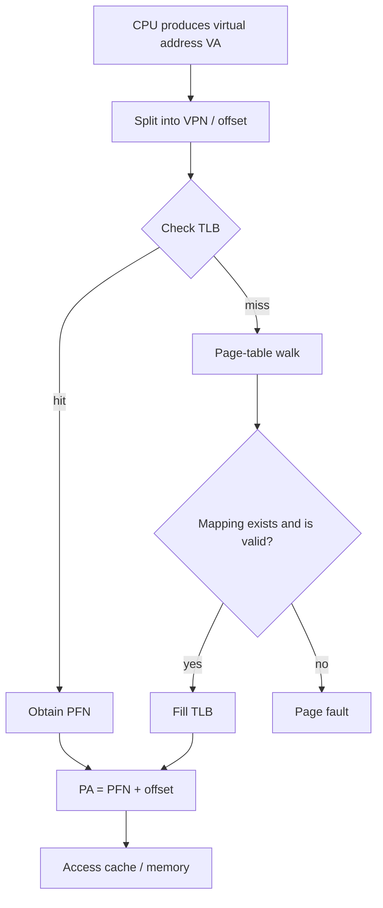

# Virtual Memory

Modern operating systems usually do not give a process direct access to physical memory addresses. Instead, each process sees a **Virtual Address Space**.

This provides:

- **Isolation**: processes are isolated and cannot freely access one another's memory.
- **Security**: user-mode programs cannot directly modify kernel memory.
- **Simpler programming**: a program appears to own a contiguous address space.
- **Flexible management**: the OS can allocate physical pages on demand and implement paging, shared memory, and memory-mapped files.

When the CPU executes a load or store, the address in the program is normally a **virtual address (VA)**. It must be translated into a **physical address (PA)** before memory is accessed.

* Virtual address &rarr; the address seen by the program.
* Physical address &rarr; the address corresponding to a location on the DRAM chips.

> For example, pointer `p = 0x7fff12345678` is usually a virtual address.

---

# Page

Virtual and physical memory are generally managed as fixed-size blocks.

## Page Frame / Physical Page Frame

A page-sized slot in physical memory. A virtual page is ultimately mapped to a physical page frame.

## Page Table

A data structure used jointly by the OS and hardware. It records:

- Which physical frame a virtual page maps to
- Whether the mapping is valid
- Whether it is readable, writable, or executable
- Whether user mode may access it
- Whether it has been accessed
- Whether it has been modified (dirty)

## Page-Table Entry

Each item in a page table is a page-table entry. A typical entry contains:

- **PFN / PPN**: physical page-frame number
- **Present / Valid bit**: whether the mapping exists
- **R/W/X bits**: whether it can be read, written, or executed
- **User/Supervisor bit**: whether user mode may access it
- **Accessed / Referenced bit**: whether it has been accessed
- **Dirty bit**: whether it has been written
- **Cache-control bits**: whether caching is allowed and which write-back policy applies

If an entry is invalid or not present, accessing the address may trigger a page fault.

---

# Basic Virtual-Address Structure

A virtual address is normally divided into:

- **VPN (Virtual Page Number)**
- **Page offset**

The general translation process is:

1. Use the VPN to find a page-table entry.
2. Extract the physical page-frame number (PFN) from the entry.
3. Combine the PFN and offset to produce the physical address.

> [!NOTE]
> For a 4 KB page:
> - The page offset needs 12 bits because 4 KB = 2^12.
> - The remaining high bits form the VPN.

---

# Address Translation

## Single-Level Page Table

Assume that:

- The page-table base register (PTBR) points to the page table's start.
- Every page-table entry has a fixed size.
- The VPN from the virtual address is known.

The page-table-entry address is:

```text
PTE_address = PTBR + VPN * sizeof(PTE)
```

The process is:

1. Read the PTE from memory.
2. Check the valid and permission bits.
3. Extract the PFN.
4. Combine it with the offset to obtain the PA.

## Multi-Level Page Table

Split the VPN into several pieces. Each level points to the next-level page table rather than directly to a physical page; only the final level provides the physical frame number.

```text
VA = [ level-1 index | level-2 index | ... | offset ]
```

The process is:

1. Use the L1 index to look up the first-level table.
2. Find the address of the second-level table.
3. Use the L2 index to look up the second-level table.
4. Obtain the final PFN.
5. Combine it with the offset to obtain the PA.

> [!IMPORTANT]
> A single-level page table can become enormous for a large virtual address space and waste memory.
>
> A multi-level table allocates page-table pages only for address-space regions that are actually used, saving substantial memory for sparse address spaces.
>
> Imagine a hotel with 1,000 rooms on 10 floors, 100 rooms per floor, where only the first floor is occupied:
> * A single-level table creates space for all 1,000 rooms and marks the relevant room `[000, 001, ..., 999]`.
> * A two-level table uses the first level for floors and the second for rooms on an occupied floor. It creates and marks only the first floor: `[0: [00, 01, ..., 99]]`.

---

# TLB (Translation Lookaside Buffer)

The TLB is a hardware cache dedicated to address-translation results. It caches mappings such as `{VPN1: PFN1, VPN2: PFN2, ...}`.

## Why Is a TLB Needed?

If every memory access traversed a multi-level page table, one load or store would require several additional memory accesses just to look up the translation.

The CPU therefore checks the TLB first:
```cpp
if (TLB hit) {
        use the PFN directly
} else {
        page table walk
}
```

---

# Page-Table Base Register (PTBR)

The PTBR usually stores the physical address of the current process's page-table root. During a process switch, the OS normally changes this root address, causing future translations to use the new address space. Different processes can therefore use the same virtual address while the different PTBR values translate it to different physical pages.

---

# Page Size

| Page size | Advantages | Disadvantages |
|---|---|---|
| Smaller pages | Less internal fragmentation; finer-grained allocation and better memory utilization; less data loaded per page fault | More pages for the same virtual space; larger page tables; less memory covered by the TLB; greater translation and page-management overhead for large contiguous access |
| Larger pages | Fewer pages; smaller page tables; the same number of TLB entries covers more memory; better for sequential scans and large contiguous accesses | More internal fragmentation; more data loaded per page fault; coarser and less flexible allocation and reclamation |

---

# Cache vs. TLB

The TLB caches address translations, while the cache stores actual data or instructions. A memory access can therefore be understood approximately as:

1. Translate the address using the TLB or page table.
2. Use the physical address to check the cache.
3. On a cache miss, access main memory.

---

# Overall Flow


