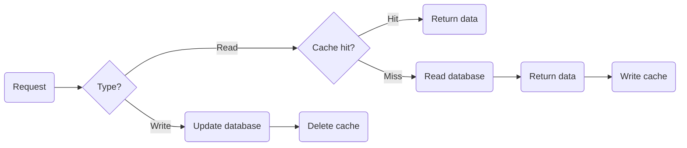
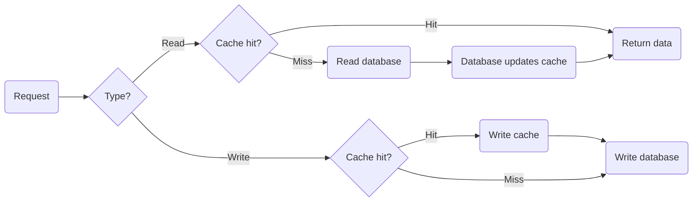
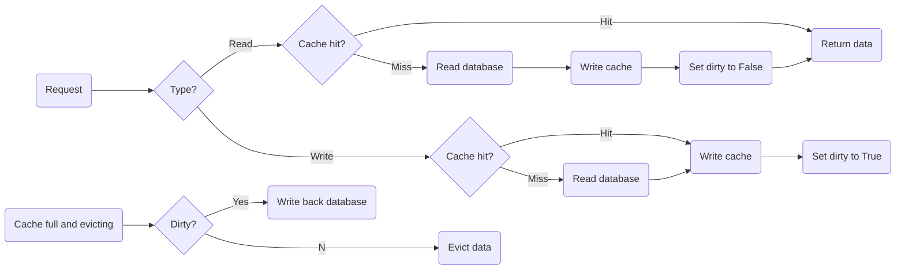

# Caching

Redis stores data in memory and therefore has fast read and write performance. It is often used as middleware for caching to avoid frequent disk access.

## Common Cache-Update Strategies

### Cache Aside

The application interacts with both the cache and the database and is responsible for maintaining them.



> [!IMPORTANT]
> The write strategy must **update the database before writing the cache**. Reversing the order can create inconsistencies under concurrent reads and writes. See [Chapter 10: Consistency](./10_consistency.md) for examples.

Cache Aside suits **read-heavy, write-light** workloads. Frequent writes repeatedly clear the cache and reduce the hit rate. Possible alternatives are:
1. Update the cache as well, but acquire a distributed lock before updating so only one thread updates it. The cost is lower write performance.
2. Update the cache as well, but give it a short expiration time so an inconsistent value expires quickly.

### Read/Write Through

The application interacts only with the cache, and the cache interacts with the database.



### Write Back

Write Back updates only the cache, marks the cache entry dirty, and returns without updating the next storage layer. The dirty data is written back only when it is evicted.



This strategy suits **write-heavy** workloads because writes return immediately and reach the database only when dirty data is evicted.

The problem is that data remains in memory without persistence for a long time. A system restart can therefore lose everything in the cache.

## Cache Types

Redis is often called a Cache Aside cache because it is an independent system. After deploying Redis, the application must contain the code for reading the cache, reading the database, and updating the cache.

```python
cacheKey = "..."
cacheValue = redis.get(cacheKey) # read the cache directly

# Cache miss
if cacheValue is None:
    cacheValue = db.get(cacheKey) # access the database
    redis.write(cacheKey, cacheValue) # add to the cache
```

### Read-Only Cache

* READ &rarr; read the cache first. Return immediately on a hit; otherwise read the database and let the application add the result to the cache.
* WRITE &rarr; write directly to the database.
* UPDATE &rarr; delete the cached data and update the database.
* DELETE &rarr; delete the cached data and database data.

Create, update, and delete operations do not write the cache. A later cache miss naturally triggers READ, which loads the database value into the cache.

### Read/Write Cache

Create, update, and delete data directly in the cache. Because Redis stores data in memory, a crash can lose data.

Depending on reliability and cache performance requirements, there are two write-back strategies:
1. Synchronous write-back &rarr; write the cache first, block while writing the database, and then return.
2. Asynchronous write-back &rarr; write the cache first and return; write to the database when the data is evicted.

||Synchronous|Asynchronous|
|---|---|---|
|Advantage|Cache and database remain consistent; data is reliable|No database write on the request path; faster response|
|Disadvantage|Must wait for cache and database synchronization|Power loss can lose data|

## Cache Failures

### Cache Avalanche

When Redis is used as a cache, keys receive expiration times. After a key expires and is accessed, the application must read the database, return the result to the client, and put it back into Redis.

If **Redis fails** or **many key-value pairs expire at once**, many user requests hit the database directly. Database pressure increases sharply and the problem can worsen like an avalanche.

**Redis failure**

1. Circuit breaking or rate limiting &rarr; circuit breaking pauses access; rate limiting restricts request volume. Reducing database traffic at the entry point prevents the problem from accumulating.
2. Build a cluster &rarr; a cluster provides high availability.

**Mass expiration**

1. Spread expiration times &rarr; add a random value to expiration times so keys do not expire simultaneously.
2. Mutual exclusion lock &rarr; when data is absent from Redis, a business thread acquires a lock until it loads the database value and adds it to the cache. Other threads wait or return an empty value.
3. Multi-level cache &rarr; later levels store more data and use longer expiration times.
4. No expiration &rarr; omit expiration or use a background thread to renew keys shortly before expiry.

### Cache Breakdown

Cache breakdown usually refers to a **hot key**. If frequently accessed data expires, the database receives heavy pressure.

1. Use a mutual exclusion lock.
2. Do not expire the hot key, or renew it with a background thread before expiry.

### Cache Penetration

Many requests target data that exists neither in the cache nor the database. The cache can never be populated, so every request reaches the database.

1. Restrict requests &rarr; block malicious requests, such as by checking for malicious or invalid fields at the entry point.
2. Cache empty values &rarr; when data does not exist, cache a `key: null` entry.
3. Bloom filter &rarr; before accessing the database after a cache miss, check a filter. If the data is not in the filter, do not access the database.

> [!NOTE]
> A Bloom filter has two parts: (1) a bitmap initialized to all zeroes; and (2) `N` different hash functions.
>
> When inserting a value:
> 1. Apply the `N` hash functions to get `N` outputs.
> 2. Take each output modulo the bitmap length.
> 3. Set the corresponding positions to 1.
>
> When querying a value:
> 1. Apply the `N` hash functions.
> 2. Take each output modulo the bitmap length.
> 3. If any corresponding position is 0, the data does not exist.
>
> A Bloom filter's property is: **a positive result does not guarantee existence, but a negative result guarantees non-existence**.

### Comparison

|Avalanche|Breakdown|Penetration|
|---|---|---|
|Many different data items are accessed at once|One hot item is accessed concurrently|The requested data does not exist|
|Focuses on a broad collapse|Focuses on one hot point|Passes through both cache and database|
