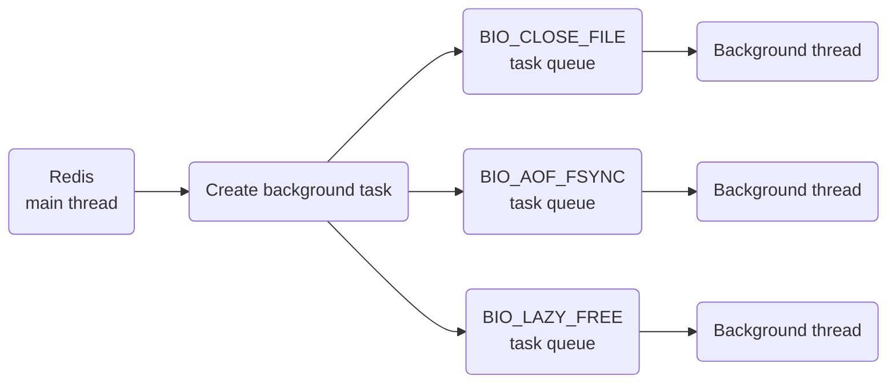

# Redis Thread Model

#### ❓ Is Redis single-threaded or multithreaded?

Redis's single-threaded model means that network I/O and key-value reads and writes use one thread. Redis still has background processes or threads for expensive work such as closing files, AOF persistence, cluster synchronization, and memory cleanup, preventing the main thread from being blocked.



#### ❓ Why does Redis not use multiple threads?

Multithreading can theoretically increase throughput, but concurrent access to shared resources creates contention and requires locks. Concurrency can then become serialization. Multiple threads also increase code complexity, so Redis chose a single-threaded execution model for its main work.

#### ❓ Why is Redis so fast?

1. Most operations are **memory-based**, which is faster than disk access. Redis also provides rich data structures with relatively simple algorithms.
2. The **single-threaded model** avoids contention and context-switching overhead.
3. **I/O multiplexing** prevents the server from waiting on one connection.

> In a basic I/O model, if a thread is receiving data with `recv()` and a client stops sending, the Redis thread remains blocked and cannot serve other requests.

#### ❓ How does Redis implement I/O multiplexing with one thread?

Linux I/O multiplexing lets one thread handle multiple I/O streams through `select` or `epoll`.

In the socket model, different operations return different socket types:
* `socket()` &rarr; an *active socket*.
* `listen()` &rarr; a *listening socket*. It can be non-blocking, so if Redis calls `accept()` while no connection is available, the thread can handle other work instead of waiting.
* `accept()` &rarr; a *connected socket*. It can be non-blocking, so `send()` and `recv()` do not wait continuously for data; Redis handles the socket when data arrives.

Redis can have many listening and connected sockets in the kernel. The kernel monitors them and notifies Redis only when a connection or data-transfer request is ready. Otherwise the Redis thread serves other operations.


1. `select` or `epoll` detects whether a socket has a request.
2. The corresponding event is triggered, such as `acceptEvent`, `readEvent`, or `writeEvent`.
3. Events are placed in an event queue, which the Redis main thread continuously processes.
4. Redis takes an event from the queue and calls its handler.

---

# Redis Persistence

#### ❓ Why does AOF execute a command before writing it to the AOF file?

1. It avoids extra validation: a failed write does not need to be recorded.
2. It does not block execution of the current command.

The problems are:
1. Blocking later operations &rarr; recording the command also happens on the main thread and blocks subsequent work.
2. Data loss &rarr; if Redis fails immediately after executing the command, the log may not contain it.

#### ❓ Why does AOF rewriting need two buffers?


> Rewriting does not rewrite every instruction in the old AOF. It reads the current in-memory data and simulates the commands needed to produce that state.
>
> If the old AOF contains `SET key value1` followed by `SET key value2`, rewriting reads `key=value2` from memory and writes only a simulated `SET key value2` to the rewritten AOF.

---

# Redis High Availability

#### ❓ Why can primary and replica instances have different key counts?

This does not necessarily mean their data is inconsistent. The primary may still have expired keys in memory; they are removed only when accessed. When the primary synchronizes through RDB, those expired keys are excluded from the RDB, so the replica can have fewer keys.

#### ❓ Is Redis replication synchronous or asynchronous? How can inconsistency be handled?

While writing data, the primary also writes to a buffer and asynchronously sends the data to replicas.

Because replication is asynchronous, the two sides can become inconsistent. Possible mitigations are:
* Keep primary-replica network connections healthy to reduce inconsistency caused by latency.
* Track the difference between the primary's write progress and the replica's read progress. If the difference becomes too large, force a backup or block the primary until the replica catches up.

#### ❓ How can failover reduce data loss?

Data loss can be caused by:
* Asynchronous replication.
* Split brain, where nodes cannot reach one another.

**Asynchronous replication loss**

Track the difference between primary write progress and replica read progress. If the difference is too large, prevent the primary from accepting requests until synchronization resumes or the difference becomes small enough.

**Split brain**

Suppose the primary loses contact with replicas while clients can still reach it. Sentinel may elect a new primary from the replicas, resulting in more than one primary.

When the network recovers, the old primary is demoted and attempts to synchronize with the new primary. Because the first synchronization is full replication, the new primary's data overwrites the old primary's data. Writes processed by the old primary during split brain are erased.

Redis can be configured so that:
* The primary must have at least `n` connected replicas.
* Replication progress cannot fall behind by more than a threshold.

When these conditions are not met, the primary blocks service. Even during split brain, the old primary cannot accept new writes. When it reconnects and is demoted, it has no new data to lose.

#### ❓ Why does Redis Cluster use modulo `2^14` for hash slots?

1. Network bandwidth &rarr; Cluster is decentralized and uses Gossip to exchange node information. Too many slots would make messages too large.
2. Redis clusters have a limited number of primary nodes, so `2^14` provides enough slots for each node.
3. An appropriate collision rate &rarr; more slots reduce hash collisions, and `2^14` is a practical balance.

#### ❓ Why does Redis Cluster not use consistent hashing?

Consistent hashing:
* Its advantage is **less data migration**. Nodes form a hash ring, and after one fails, its data can move to the next node clockwise.
* Its disadvantage is **data skew**. If data was evenly distributed and one node fails, the next node on the ring may receive twice as much data.

> One solution is to map physical nodes to virtual nodes:
> ```
> Physical node 1: virtual node 1, virtual node 5, virtual node 9
> Physical node 2: virtual node 2, virtual node 6, virtual node A
> Physical node 3: virtual node 3, virtual node 7, virtual node B
> Physical node 4: virtual node 4, virtual node 8, virtual node C
>
> After physical node 2 fails, redistribute virtual nodes:
>
> Physical node 1: virtual node 1, virtual node 5, virtual node 9 | virtual node 2
> Physical node 2: X
> Physical node 3: virtual node 3, virtual node 7, virtual node B | virtual node 6
> Physical node 4: virtual node 4, virtual node 8, virtual node C | virtual node A
> ```

Redis Cluster uses hash-slot sharding. Consistent hashing prioritizes minimal data migration, while hash slots prioritize **even distribution**. Static slots also make it easy to **assign slots manually**, such as assigning fewer slots to a weaker node.

---

# Redis Eviction and Expiration

#### ❓ What happens to expired keys in a primary-replica setup?

Replicas do not scan for expiration. An expired key on a replica can therefore still return a value.

Expired-key handling on replicas depends on the primary. When a key expires on the primary, Redis simulates a `DEL` command in AOF and synchronizes it to replicas, which execute the command to remove the key.

#### ❓ What happens to expired keys during persistence?

* RDB
  * Memory to RDB &rarr; Redis checks expiration and excludes expired content.
  * RDB load to memory &rarr; a primary loads only unexpired content; a replica loads all content.
* AOF
  * Writing the AOF &rarr; Redis simulates a `DEL` for an expired key.
  * AOF rewrite &rarr; expired keys are not rewritten.

#### ❓ What happens when Redis runs out of memory?

When Redis reaches its configured memory threshold, the memory-eviction mechanism starts.

---

# Redis Caching

#### ❓ Why delete the cache on writes instead of updating it and writing it again on the next read?

* Deletion is simpler than updating and less likely to fail.
* Cached data may be complex, such as an aggregation result.
* Updating data does not mean it will be accessed soon.

There is no need to update a large value that may never be read and may be evicted anyway. Deleting it and loading it lazily when needed better matches the business logic.

---

# Redis Applications

#### ❓ How can Redis implement a delayed queue?

A delayed queue postpones task execution, such as cancelling an unpaid order after a period of time.

Use a ZSet's score: store a timestamp or similar value as the score when creating the task, then use `ZRANGEBYSCORE` to retrieve tasks whose processing time has arrived.

#### ❓ Can a Redis transaction roll back?

Each individual Redis operation is atomic, but a transaction containing multiple operations does not guarantee rollback. If a transaction fails or stops halfway through, the state does not return to its pre-transaction state.

#### ❓ What is a Redis pipeline?

A pipeline sends multiple commands together for Redis to process as a batch. It makes better use of network bandwidth and reduces network overhead.

#### ❓ How does Redis implement distributed locks? What is RedLock?

A distributed lock generally needs:
* Mutual exclusion &rarr; only one client can hold the lock.
* No deadlock &rarr; one client cannot hold the lock forever.
* Fault tolerance &rarr; lock state cannot be maintained by only one server, avoiding a single point of failure; multiple nodes must reach agreement.
* Ownership &rarr; the client that acquires and releases the lock must be the same client.

Acquire a lock with `SET lock_key unique_val NX PX 10000`:
* `lock_key` is the lock name.
* `unique_val` is the client's UUID.
* `NX` provides mutual exclusion by setting the key only if it does not exist.
* `PX 10000` prevents deadlock by making the lock valid for 10 seconds, so a client failure does not leave it forever.

Release the lock atomically with a Lua script: first verify that the requesting client and lock-owning client are the same, then delete the key.

Using Redis for distributed locks:

| Advantages | Disadvantages |
|:---:|:---:|
| High performance | The `PX` timeout is difficult to choose<sup>[*]</sup> |
| Simple implementation | Primary-replica replication is asynchronous. If the primary holding a lock fails before replication, the new primary believes the lock is free and different nodes can grant different locks. |
| Fault tolerance through a Redis cluster | |

> [*] A watchdog thread can extend the lock lifetime while the main thread is still working, until the main thread exits and releases it.

RedLock improves distributed-lock reliability across a cluster:
* The client records the current time `t1`.
* It requests the lock from `N` nodes.
  * Each node uses `SET lock_key unique_val NX PX ...`.
  * The lock-acquisition operation has its own timeout. If that timeout expires, the node is considered unable to grant the lock. The acquisition timeout must be shorter than the lock's own expiration time.
* If more than half the nodes grant the lock, the client records `t2`. Acquisition succeeds only if (1) more than half the nodes granted it and (2) acquisition time `t2-t1` is shorter than the lock's expiration time.
* After acquiring the distributed lock, recalculate the remaining expiration time because some of the lifetime was spent acquiring it.

To release the lock, send a request to every node to run the Lua script.

#### ❓ What impact do large keys have, and how can they be deleted?

A large key has a very large value or a very large key-value pair. Problems include:
1. Client timeout &rarr; processing a large key in a single-threaded server blocks other services, so the client may see no response.
2. Network blocking &rarr; frequent reads of a large key create substantial network traffic.
3. Thread blocking &rarr; commands such as `DEL` or persistence can block the main thread.
4. Uneven memory allocation &rarr; in a cluster, a large key can make slot load uneven, leaving one slot with much more data.

> [!NOTE]
> With AOF `always`, frequent `fsync()` calls can block the main thread. During RDB persistence and AOF rewriting, forking a child and COW can also be blocked by large keys.

Two deletion approaches are:
1. Delete in batches &rarr; remove part of the large value at a time, such as splitting a large List into smaller segments.
2. Delete asynchronously &rarr; use `UNLINK` instead of `DEL`, and configure Redis to use asynchronous deletion in relevant scenarios.

> [!NOTE]
> `UNLINK` performs deletion in a background thread; `DEL` uses the main thread.

> [!NOTE]
> These settings enable asynchronous deletion:
> * `lazyfree-lazy-eviction` &rarr; use lazy freeing during memory eviction.
> * `lazyfree-lazy-expire` &rarr; use lazy freeing when keys expire.
> * `lazyfree-lazy-server-del` &rarr; when a primary's expired key is represented by a simulated `DEL` in AOF, use lazy freeing instead.
> * `replica-lazy-flush` &rarr; use lazy flushing when a replica receives a full synchronization.
